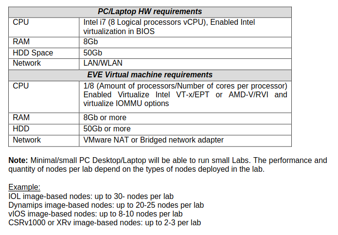
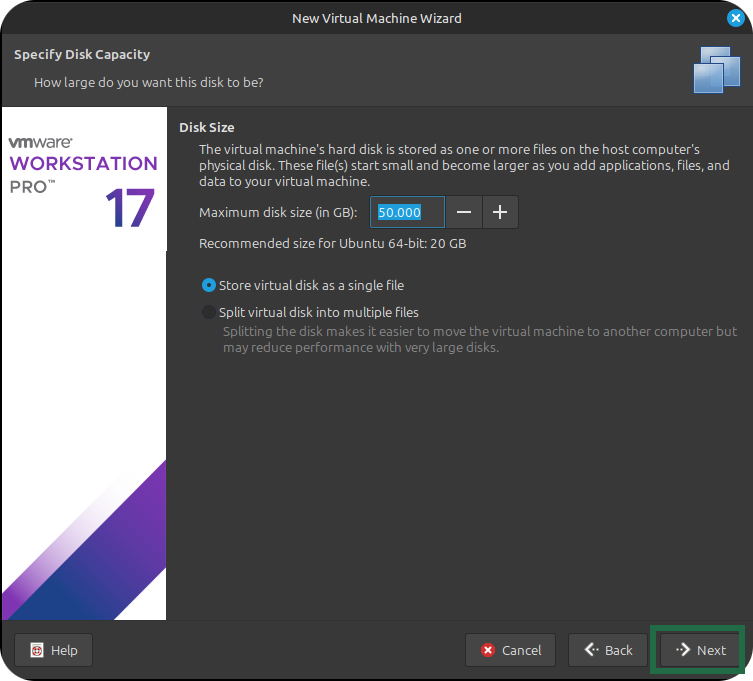
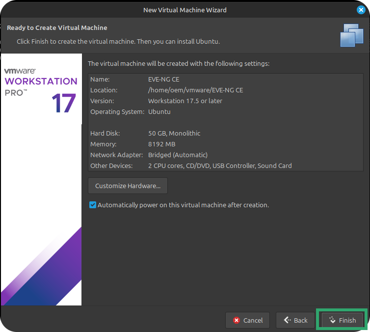

### [Cybersecurity](https://github.com/Komonodrg-portfolio/Cybersecurity) | [Networking](https://github.com/Komonodrg-portfolio/Networking) | [Data Science (AI)](https://github.com/Komonodrg-portfolio/AI) | [Media Creation](https://github.com/Komonodrg-portfolio/MediaCreation) | [Mission](https://github.com/Komonodrg-portfolio/Mission/)

---
---

# 🏠 Home Network Lab Creation using EVE-NG

This project demonstrates a simulated enterprise-like network lab built using **EVE-NG (Emulated Virtual Environment Next Generation)**. It's designed to emulate a small business or advanced home network, complete with routers, switches, firewalls, and virtual hosts.  With a labtop of 16GB  (recommended) of ram, this platform allows training from anywhere in the world.

---

## 📌 Goals
To illustrate a cost effective platform to  allow for the practice and self study in Network Engineering via providing the ability to:

- Design and emulate a complex network topology
- Practice configuration of Cisco routers, Layer 2/3 switches, and firewalls
- Test routing protocols (OSPF, EIGRP, BGP)
- Implement VLANs and inter-VLAN routing
- Simulate internet connectivity with NAT/PAT
- Prepare for CCNA/CCNP certification as well as network automation
- **Can even be expanded to allow for cyber security training**

---

## 🧰 Tools & Technologies

| Tool       | Purpose                              |
|------------|--------------------------------------|
| EVE-NG     | Network Emulation Platform           |
| Cisco IOU / Dynamips | Router & Switch Emulation         |
| pfSense / OPNsense    | Open-source Firewall/Router          |
| Linux  / Windows VMs  | Host Simulation                      |
| Wireshark  | Packet Capture and Analysis          |

---

---

## 🔧 Setup Instructions

### Prerequisites

This guide will illustrate how to setup the environment both on Windows & Linux. 

 
<h4>a) System Requirements</h4>

    
Before lab setup, ensure your PC/Laptop meets minimum requirements for successful operation:  
  

**Windows:**  Click on Start > in search box type: `msinfo` > press Enter

**Linux (Mint):** Click on LM button (bottom left) > type: `System Info` > press Enter

 

  
  

Check your system specifications vs what the [official EVE-NG installation guide](https://www.eve-ng.net/index.php/documentation/) recommends.  As of the date of this repo creation, current recommended specs:

 

  

 
<h4>b) Download Hypervisor (VMWare)</h4>

    
  For this lab, we will run EVE-NG as a virtual machine from within a <a href="https://chatgpt.com/share/68cb87a6-3580-800b-a816-6c42bfab1272/">hypervisor</a> (type 2).  Both Linux and Windows versions are free, but require <a href="https://support.broadcom.com/">signing up for a broadcom account</a> first: 
   

 
 
 
 
 

  
 
Once the installation file downlods successfully, proceed with installation of VMWare:  

 

 
<h4>c) Install VMWare Workstation</h4>

    
  
**Windows:**  Navigate to where the file downloaded, and double click it to start the installer...

**Linux:** A few extra steps are needed prior in order to get this installation completed:
 
Open up **Terminal** to install VMWare:
 
 

| Step    | Command |
|---------|---------|
| | 1) Navigate to EVE-NG Download page and download both:   a) EVE-NG CE.iso  b) Client Side Toools (Windows/Linux)  | `sudo apt install build-essential linux-headers-$(uname -r)` || `sudo apt install build-essential linux-headers-$(uname -r)` |
| 2) Navigate to download location  | `cd ~/Downloads` |
| 3) List files in Downlaods folder  | `ls` |
| 4) Make installation file executable  | `chmod +x VMWare...bundle` |
| 5) Run installation file  | `sudo ./VMWare...bundle` |
 

 
  
 

 

 ---

 

 
 
 
 

  

  

 

 

### 1. Install EVE-NG VM in VMWare
Follow the [official EVE-NG installation guide](https://www.eve-ng.net/index.php/documentation/) to learn bare-metal setup or continue on to see how to set it up in VMware. 
 
Where running it on Windows or Linux (Mint), the setup process is pretty much the same:
  
1) Navigate to EVE-NG Download page and download both:   
a) EVE-NG CE.iso  
b) Client Side Toools (Windows/Linux)

  |    
 
2) In VMWare, click `file` >  `New Virtual Machine...`  >

 |    

... Click `Browse`, navigate to where the EVE-NG.iso file is and select it before proceeding to `Next`.  

 | 
 |  
 |  
Ensure you have the appropriate Cisco and pfSense images loaded into EVE-NG. Add them via the `/opt/unetlab/addons/qemu` path.

### 3. Import or Recreate the Lab
You can:
- Import the provided `.unl` lab file (if included), or
- Recreate the topology manually in EVE-NG using the included topology diagram and configs.

### 4. Connect EVE-NG to Internet
To simulate external access (e.g., software updates on Ubuntu), configure a cloud interface to your host system’s bridge or NAT.

---
