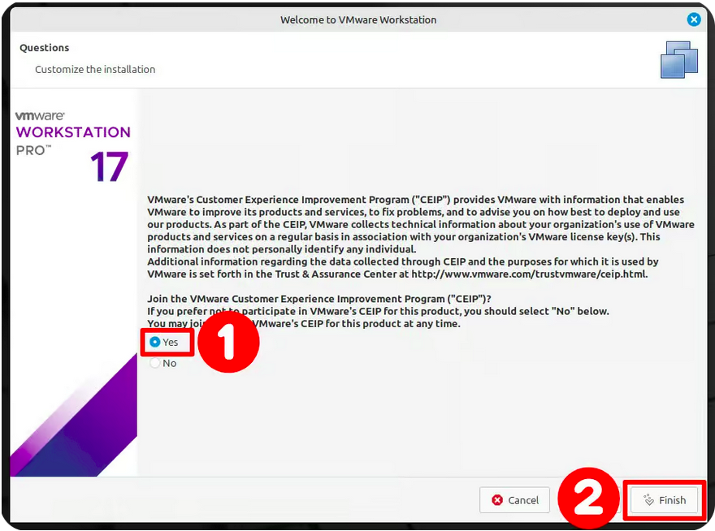
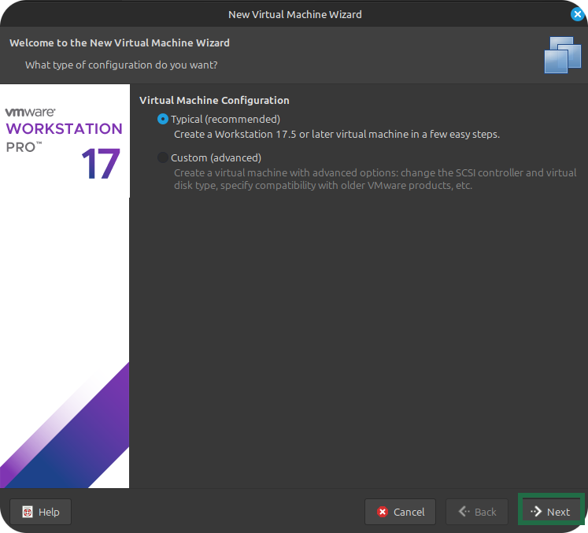
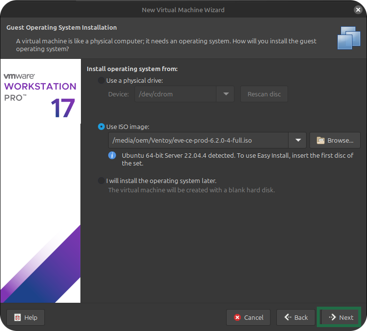
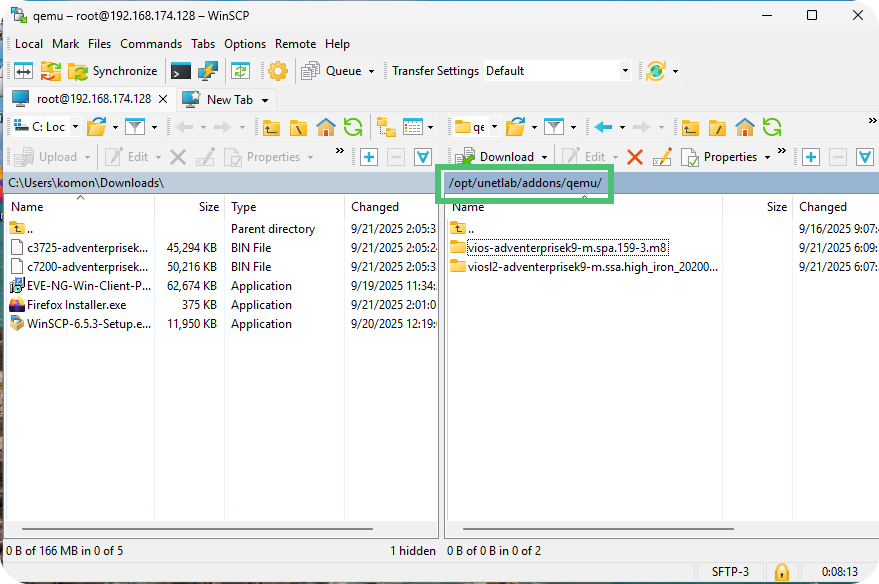
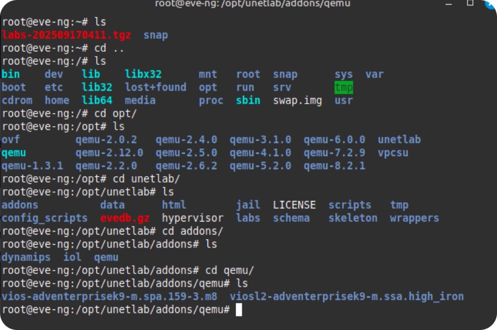
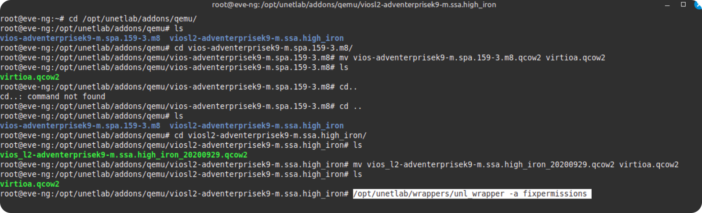

### [Cybersecurity](https://github.com/Komonodrg-portfolio/Cybersecurity) | [Networking](https://github.com/Komonodrg-portfolio/Networking) | [Data Science (AI)](https://github.com/Komonodrg-portfolio/AI) | [Media Creation](https://github.com/Komonodrg-portfolio/MediaCreation) | [Mission](https://github.com/Komonodrg-portfolio/Mission/)

---
---

# 🏠 Home Network Lab Creation using EVE-NG

This project demonstrates a simulated enterprise-like network lab built using **EVE-NG (Emulated Virtual Environment Next Generation)**. It's designed to emulate a small business or advanced home network, complete with routers, switches, firewalls, and virtual hosts.  With a labtop of 16GB  (recommended) of ram, this platform allows training from anywhere in the world.

---

## 📌 Goals
To illustrate a cost effective platform to  allow for the practice and self study in Network Engineering via providing the ability to:

- Design and emulate a complex network topology
- Practice configuration of Cisco routers, Layer 2/3 switches, and firewalls
- Test routing protocols (OSPF, EIGRP, BGP)
- Implement VLANs and inter-VLAN routing
- Simulate internet connectivity with NAT/PAT
- Prepare for CCNA/CCNP certification as well as network automation
- **Can even be expanded to allow for cyber security training**

---

## 🧰 Tools & Technologies

| Tool       | Purpose                              |
|------------|--------------------------------------|
| EVE-NG     | Network Emulation Platform           |
| Cisco IOU / Dynamips | Router & Switch Emulation         |
| pfSense / OPNsense    | Open-source Firewall/Router          |
| Linux  / Windows VMs  | Host Simulation                      |
| Wireshark  | Packet Capture and Analysis          |

---


---

## 🔧 Setup Instructions

### Prerequisites

This guide will illustrate how to setup the environment both on Windows & Linux. 

<details>
 <summary><h4>a) System Requirements</h4></summary>
  <br> 
Before lab setup, ensure your PC/Laptop meets minimum requirements for successful operation:<br> 
 <br>

**Windows:**  Click on Start > in search box type: `msinfo` > press Enter

**Linux (Mint):** Click on LM button (bottom left) > type: `System Info` > press Enter


 <p align="center">
  
  
</p>

Check your system specifications vs what the [official EVE-NG installation guide](https://www.eve-ng.net/index.php/documentation/) recommends.  As of the date of this repo creation, current recommended specs:


 <p align="center">
  

</details>
<details>
 <summary><h4>b) Download Hypervisor (VMWare)</h4></summary>
  <br> 
  For this lab, we will run EVE-NG as a virtual machine from within a <a href="https://chatgpt.com/share/68cb87a6-3580-800b-a816-6c42bfab1272/">hypervisor</a> (type 2).  Both Linux and Windows versions are free, but require <a href="https://support.broadcom.com/">signing up for a broadcom account</a> first:<br>
  <br>
<p align="center">
 
 
 
 
 
</p>  
<br>
Once the installation file downlods successfully, proceed with installation of VMWare:</br><br>

</details> 
<details>
 <summary><h4>c) Install VMWare Workstation</h4></summary>
  <br> 
  
**Windows:**  Navigate to where the file downloaded, and double click it to start the installer...

**Linux:** A few extra steps are needed prior in order to get this installation completed:
<br>
Open up **Terminal** to install VMWare:
<br>
<br>

| Step    | Command |
|---------|---------|
| 1) Install required dependencies | `sudo apt install build-essential linux-headers-$(uname -r)` |
| 2) Navigate to download location  | `cd ~/Downloads` |
| 3) List files in Downlaods folder  | `ls` |
| 4) Make installation file executable  | `chmod +x VMWare...bundle` |
| 5) Run installation file  | `sudo ./VMWare...bundle` |
<br>
<p align="left">
 
 <br>
 <p align="left">
 

 ---

 <p align="center">
 
 
 
 
</p>  


  

 
</details> 


### 1. Install EVE-NG VM in VMWare
Follow the [official EVE-NG installation guide](https://www.eve-ng.net/index.php/documentation/) to learn bare-metal setup or continue on to see how to set it up in VMware.<br>
<br>
Whether you are running it on Windows or Linux (Mint), the setup process is pretty much the same:
<br> 
a) Navigate to [EVE-NG Download page](https://www.eve-ng.net/index.php/download/) and download both: <br>
<br> 
**a) EVE-NG CE.iso**<br> 
**b) Client Side Tools** (Windows/Linux)<br>
<br> 
   
 
b) In VMWare, click `file` >  `New Virtual Machine...`  > ...

   <br> 

... Click `Browse`, navigate to where the EVE-NG.iso file is downloaded and select it before proceeding to `Next`.<br> 

  
  <br>
  <br>
<br>
<br> 

c) Select the EVE-NG instance in VMWare and click `start`, the VM will power up, ask a few setup questions through menus (select default selections through menus until installation completes)<br> 

It will reboot twice during installation, just be patient and you will eventually be met with an IP address to use to login via your PC browser:

  

<details>
 <summary><h3><em><b>🛠️  "Troublshooting..."</b></em></h3></summary>
  <br> 
<em>From within VM Window, there is an error message that neither virualization platforms "Intel VT-x or AMD V is found", as the option when creating the VM was greyed out.  Even after enabling Virtualization in the BIOS, still had the same error:
 
  
 
 Doing a quick ask of CHATGPT provided steps to  assist in resolving the issue</em><br>
<br>
<b>My Vision:</b><br>
    
- <b>To partner or create a foundation that will provide repurposed/decommissioned cellphones / laptops to individuals in remote area</b>
- <b>Provide scholarships to cover the costs for IT Certifications to individuals showing deep aptitude, skill, and readiness</b><br>

<em>Enjoy these pictures from the trip.

Colleagues,Onward.<br></em>

  


<p float="center">
  

</details>


Click in VM window, login (press `ENTER` to get login prompt) and update your EVE-NG VM:  `Login:root/Password:eve`<br> <br>

To update EVE-NG VM, after logging in, enter command:

```bash
apt update & apt upgrade -y
```

 <br>

d) Install Client Tools<br>

**Windows:** Navigate to the folder where the Windows Client Tools.exe is located, double click it to run it (click `Next` through each component install):

 <br>

**Linux:** The [instructions](https://github.com/SmartFinn/eve-ng-integration) for linux (mint/debian) involve a few more steps:

From **Terminal** enter:

```
wget -qO- https://raw.githubusercontent.com/SmartFinn/eve-ng-integration/master/install.sh | sh
```

Next, install required dependencies:
```

# Required dependencies
sudo apt install python3 telnet

# Recommended dependencies
sudo apt install wireshark ssh-askpass vinagre

# Optional dependencies (if you need Docker)
sudo apt install docker.io
```

 <br>

 


e) Confirm you are able to access EVE-NG by opening up a web brower (Firefox/Chrome) and typing in the IP Address given by EVE-NG VM:
<p float="center">
  
  

### 2. Import Cisco Images into EVE-NG

a) In order to be able to use devices (routers/switches) in your lab topologies, their image files must first be added to EVE-NG:

**Windows:** Download and install [WinSCP](https://winscp.net/eng/download.php)

 <br>

During Setup...Select `Typical Installation` > `Commander Style` > `Install` > `Finish`<br>
Enter in the login information for EVE-NG to connect to your VM from WinSCP, which will allow to transfer files to it.<br>

**Linux:** Unlike Windows, Linux Mint's default file explorer has the SFTP capability to allow direct communication with EVE-NG by clicking on navigation bar and typing in:<br>

```
sftp://<yourIPAddress>
```

 <br>

In order to allow for two pane look, much like WINSCP or Filezilla (provides ease for drag and drop), from `File Explorer` > click `View` > select `Extra Pane` -OR- press the key  `F3`:

 

... with access to EVE-NG file system, we are now ready to upload Cisco images.  You can find some practice images in the `ios/` folder in this repo.

Per [instructions from official documentation](https://www.eve-ng.net/index.php/documentation/howtos/howto-add-cisco-vios-from-virl/):

b) To upload any image (router, switch, firewall, windows, linux, etc) you must navigate to location in EVE-NG file system to upload image files into created folders, each with a particular [folder name prefix](https://www.eve-ng.net/index.php/documentation/qemu-image-namings/).  For this lab, we will focus only the ones specific for our needs for CCNA/CCNP study and lab practice:

  

c) Upload Cisco Router (L3 & L2) Images:<br>
<br>

From WinSCP (Windows) or File Explorer (Linux), navigate to `/opt/unetlab/addons/qemu` path and create 2 folders, naming it "`vios-<YourFileName>`" & "`viosl2-<YourFileName>`", then copy and paste image .qcow2 files into created folders from download location:

 <br>

We must now fix permissons to allow EVE-NG to accept and properly run the images.  Though you can manage and enter the command from EVE-NG VM window in VMWare, lets do it from our **Terminal**:

| Step    | Command |
|---------|---------|
| 1) Open Terminal and ssh login into EVE-NG | `ssh root@<EVE-NG VM IP address>` |
| 2) Navigate to `qemu/` folder location  | (see pic for linux cli navigation commands) |

 <br>

| Step    | Command |
|---------|---------|
| 3) Change name of .qcow2 files in both folders to `virtioa.qcow2` |  -`mv vios-adventerprisek9-m.spa.159-3.m8.qcow2 virtioa.qcow2` <br> -`mv viosl2-adventerprisek9-m.spa.159-3.m8.qcow2 virtioa.qcow2` |
| 4) Fix file permissions  | `/opt/unetlab/wrappers/unl_wrapper -a fixpermissions` |



d) Upload Cisco IOL (IOS on Linux) Images:

From WinSCP (Windows) or File Explorer (Linux), navigate to `/opt/unetlab/addons/iol/bin` path, then copy and paste image files into this location:

 <br>

From EVE-NG cli (command line interface), enter command:

```
/opt/unetlab/wrappers/unl_wrapper -a fixpermissions
```


Ensure you have the appropriate Cisco and pfSense images loaded into EVE-NG. Add them via the `/opt/unetlab/addons/qemu` path.

### 3. Import or Recreate the Lab
You can:
- Import the provided `.unl` lab file (if included), or
- Recreate the topology manually in EVE-NG using the included topology diagram and configs.

### 4. Connect EVE-NG to Internet
To simulate external access (e.g., software updates on Ubuntu), configure a cloud interface to your host system’s bridge or NAT.

---
